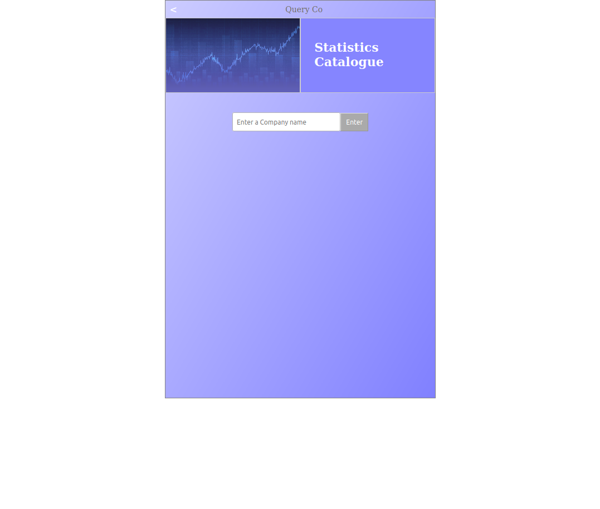
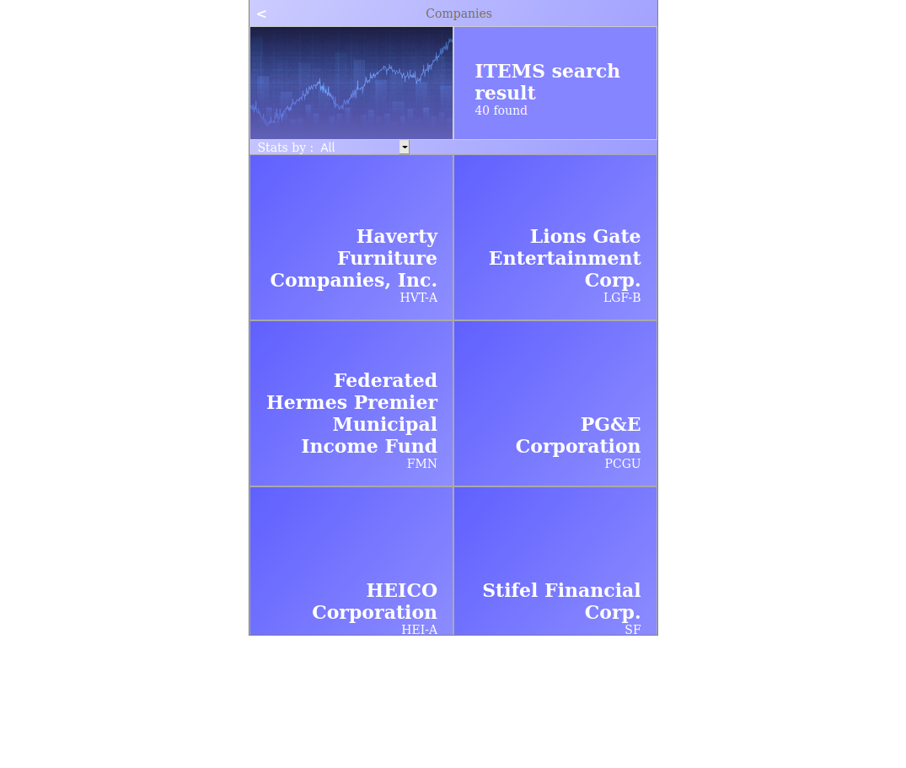
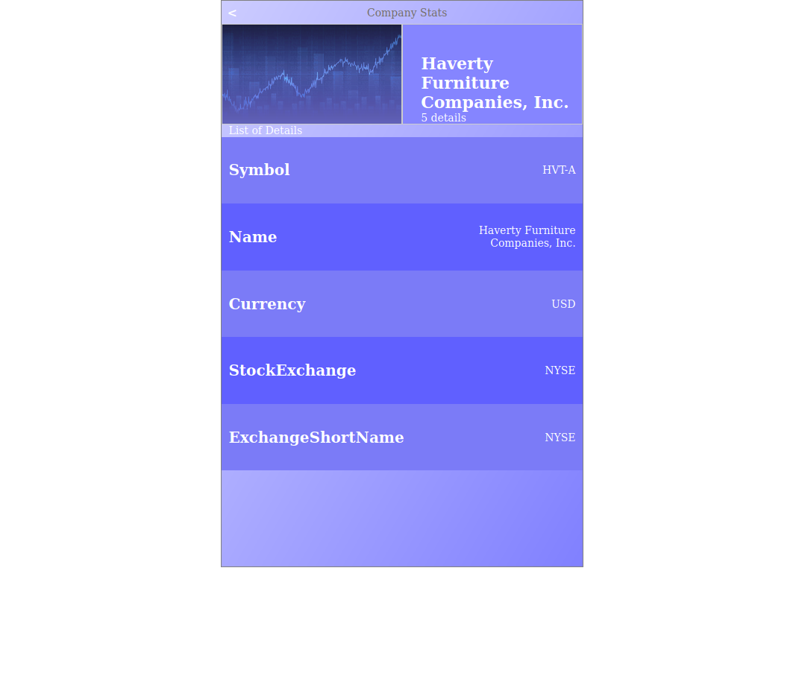

# Catalogue of Statistics
This is a WebbApp simulating a phone app to search for company statisctics via an API call to [financialmodelingprep](https://financialmodelingprep.com/). Coded mainly with React and Redux.
Built according to [Microverse's requirements](https://www.notion.so/Catalogue-of-Statistics-72446e7fa33c403a9b6a0bc1de5c6cf5#ae194b0436a64e19bcc7ba295302118a).

## Links
[GitHub Repo](https://github.com/NewIncome/catalogue-of-statistics)
[:globe_with_meridians::computer: Heroku Livelink](https://statistics-catalogue.herokuapp.com/)

## Built With 

- REACT
- REDUX
- JavaScript (ES6)
- NPM
- HTML5
- CSS

## Getting Started

In order to start with this project you need the next:

1. Get a copy of this project [this repository :blue_book:](https://github.com/NewIncome/catalogue-of-statistics)

Once you have cloned this project
1. Go to project folder
2. run `npm install` or `yarn install`
3. run `npm start`

### Usage

- Enter the **Name** of a company you wish check it's stats, for a list of companies that have that name or those letters i it's name
- Click on the **Company item** you like to see it's details/stats
- You can additionally Select filter to view less companies, either by **currency** or by **stockExchange**

## Improvements

Features pending to add to this app:
- add images relevant to each company via another API
- add improved UI with CSS

## Author
👤 **Jose Alfredo Cardenas**

- Github: [@Jose Alfredo](https://github.com/NewIncome)
- Twitter: [@J_A_fredo](https://twitter.com/J_A_fredo)
- LinkedIn: [Jose Alfredo Cardenas](https://www.linkedin.com/in/j-alfredo-c/)  

## 🤝 Contributing

Contributions, issues, and feature requests are welcome!

## Show your support

If you got until here, show your love hitting the ⭐️ button, greatly appreciated.

## 📝 License

MIT
